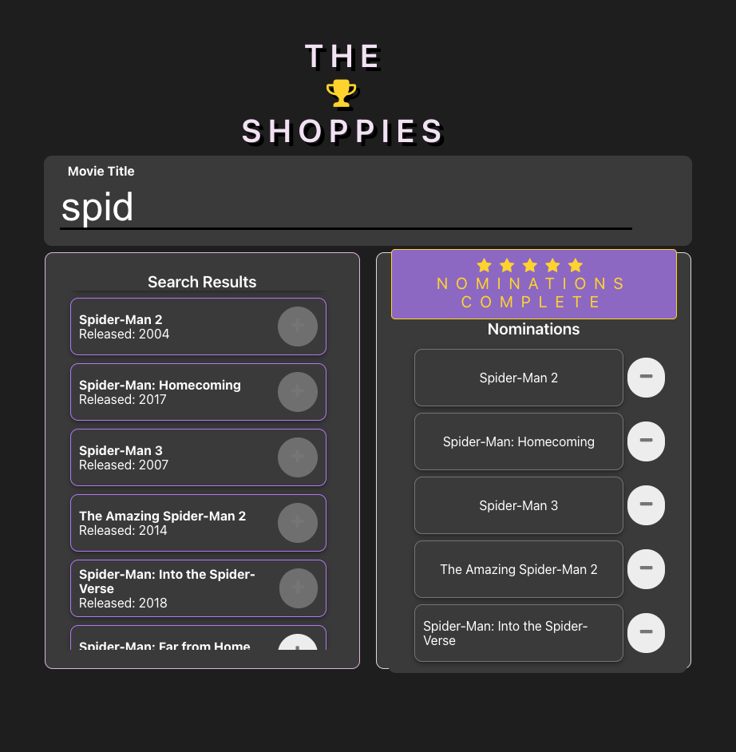

# The Shoppies

Shoppies is an application to nominate movies for the shoppy awards!

Live demo website: [https://the-shoppies-567.netlify.app/](https://the-shoppies-567.netlify.app/)

## Example

## Installation

 In order to run this application you will need [node](https://nodejs.org/en/download/) and [npm](https://www.npmjs.com/get-npm) installed globally on your machine.

1. Clone this repo and cd into file
2. Install dependencies
    ###### `$ npm install`
3. Start server
    ###### `$ npm start`
4. Visit application at
    ###### `localhost:3000`

## Tech Stack    
- Javascript
- React.js 

## Tools
 - [OMDB api](http://www.omdbapi.com/)
 - [Styled Components](https://styled-components.com/)
